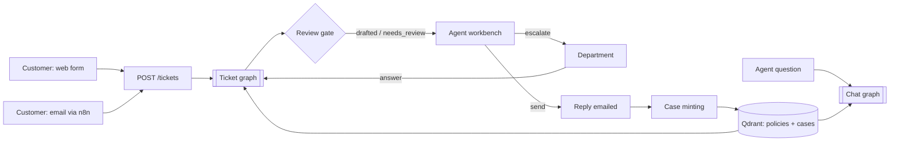
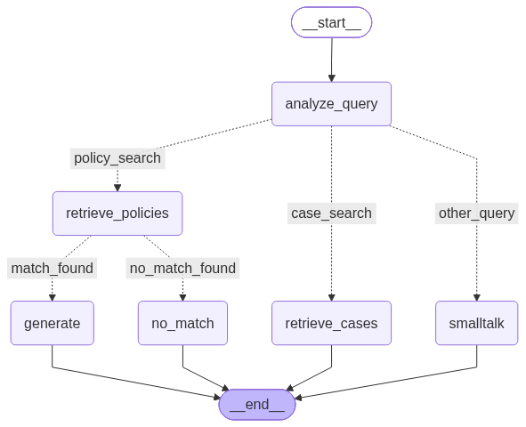
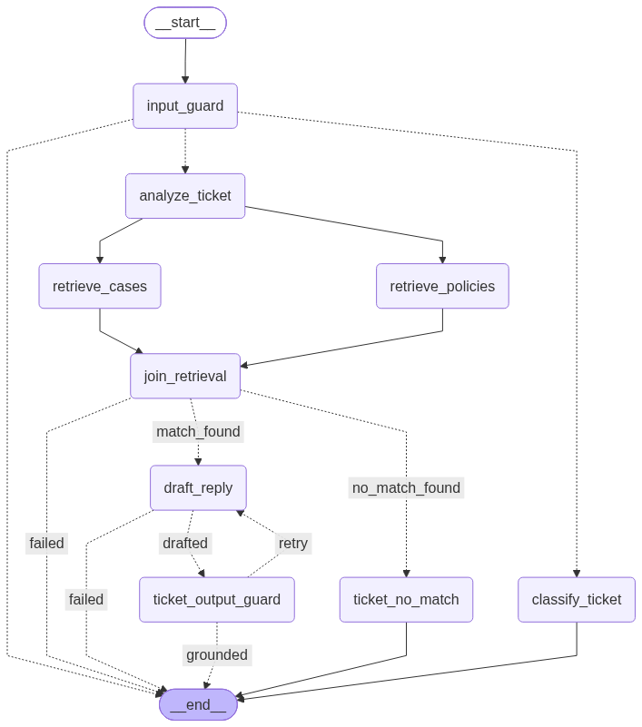

# Complaint Management System

An LLM-powered support desk for customer complaints.

A complaint can arrive through the web form or by email. When it does, a LangGraph agent masks
personal data in it and routes it to one of 12 departments. It then retrieves the relevant company
policies and similar past cases, and drafts a cited reply to the customer. A deterministic gate
decides whether the draft needs a closer look. A support agent then sends the reply (edited or not)
or escalates the complaint to a department. If the department answers, the agent redrafts the reply
from that answer.

Every reply that goes out becomes a new searchable case, so the next similar complaint is drafted
from what the team actually did.

Agents also get a chat assistant built on the same retrieval stack. It answers questions like
*"what's our replacement window for a defective unit?"* or *"have we seen this error code before?"*

The seed corpus models an Indian D2C e-commerce brand: 34 policies and 200 resolved cases across 12
departments.

### At a glance

- **2 LangGraph workflows.** A **19-node chat graph** (5 parent nodes and two 7-node subgraphs) and a
  **10-node ticket graph**. The two share their guard and retrieval nodes.
- **Hybrid RAG.** Dense and BM25 sparse vectors in Qdrant, fused with RRF, plus multi-query
  rewriting, a cross-encoder reranker and a relevance gate.
- **Layered guardrails.** PII and credential masking, deterministic grounding checks (citations,
  figures, policy backing), optional NeMo LLM rails, and a self-correcting regeneration loop.
- **Human in the loop.** A review gate that gives reasons in plain words, escalation to departments,
  and every send or discard recorded as feedback.
- **Knowledge flywheel.** Sent replies are summarised, scrubbed and indexed as new cases. Past
  department answers become citable precedents.
- **LLMOps.** Versioned prompts, model routing by role, LangSmith tracing, per-node run timings, and
  deepeval suites over 5 golden datasets.

---

## How it works



Supabase (Postgres) is the source of truth for tickets, drafts, cases, policies and feedback.
Qdrant is a derived index that can be rebuilt from it. MongoDB holds chat history.

---

## LLM architecture

### Workflow 1: the chat graph (19 nodes)

This is the agent's assistant, served over SSE at `POST /api/v1/chat`. A parent graph guards and
classifies each message, then hands it to one of two compiled subgraphs ("lanes"). Each lane has its
own retrieval, generation and guard nodes, so either can change without touching the other.




| #  | Node                       | What it does                                                                                                                                                         | Model                |
| ---- | ---------------------------- | ---------------------------------------------------------------------------------------------------------------------------------------------------------------------- | ---------------------- |
| 1  | `input_guard`              | Enforces length limits. Masks PII (Presidio, plus Aadhaar and PAN) and credentials (OTP, UPI PIN, CVV). An optional NeMo rail blocks prompt injection. Fails closed. | rules (+ cheap)      |
| 2  | `blocked_input`            | Tells the agent to handle a blocked message by hand                                                                                                                  | —                   |
| 3  | `analyze_query`            | Structured output with the intent (complaint, knowledge lookup or other), lookup target, risk flags, and 2–3 policy-worded query rewrites                           | cheap                |
| 4  | `smalltalk`                | Greetings and "what can you do?"                                                                                                                                     | cheap                |
| 5  | `record_turn`              | Saves the turn (masked text and citations) to MongoDB through the LangGraph checkpointer                                                                             | —                   |
|    | **Complaint lane**         | *Helps an agent resolve a customer's complaint*                                                                                                                      |                      |
| 6  | `retrieve_policies`        | Multi-query hybrid search, one rerank, relevance gate (see[Retrieval](#retrieval))                                                                                   | embeddings, reranker |
| 7  | `retrieve_cases`           | Top 4 similar past cases, searched with the customer's own wording (runs in parallel with 6)                                                                         | embeddings           |
| 8  | `join_retrieval`           | Waits for both retrievals, then routes to`generate` or `no_match`                                                                                                    | —                   |
| 9  | `generate`                 | Agent-facing draft that cites policies and past cases as`[n]`                                                                                                        | **main**             |
| 10 | `output_guard`             | Grounding checks. On failure it sends the reasons back to`generate` for one revision.                                                                                | rules (+ judge)      |
| 11 | `add_caveat`               | The retry failed too: keeps the draft and adds a caution banner listing the failed checks                                                                            | —                   |
| 12 | `no_match`                 | No policy cleared the relevance gate, so it says so instead of guessing                                                                                              | —                   |
|    | **Lookup lane**            | *Answers the agent's own question about policy or past cases*                                                                                                        |                      |
| 13 | `lookup_retrieve_policies` | The same policy search. Skipped when the question is only about cases.                                                                                               | embeddings, reranker |
| 14 | `lookup_retrieve_cases`    | A wider pool (20, reranked to 8, gated at 0.50), because an agent may ask for a list                                                                                 | embeddings, reranker |
| 15 | `lookup_join_retrieval`    | Reports no match only when both corpora come back empty                                                                                                              | —                   |
| 16 | `lookup_generate`          | Cited answer to the agent's question                                                                                                                                 | **main**             |
| 17 | `lookup_guard`             | The same checks, minus "must cite a policy". No retry.                                                                                                               | rules (+ judge)      |
| 18 | `lookup_caveat`            | Adds a caution banner to an answer that failed its checks                                                                                                            | —                   |
| 19 | `lookup_no_match`          | Nothing relevant in either corpus                                                                                                                                    | —                   |

### Workflow 2: the ticket graph (10 nodes)

This graph runs once per ticket, in the background after the ticket is created. It classifies the
ticket and drafts the **customer-facing** reply. Classification and drafting run as parallel
branches, so a failure in one never loses the other.




| #  | Node                  | What it does                                                                                                                                | Model                |
| ---- | ----------------------- | --------------------------------------------------------------------------------------------------------------------------------------------- | ---------------------- |
| 1  | `input_guard`         | Shared with the chat graph. Every later node sees only masked text.                                                                         | rules (+ cheap)      |
| 2  | `classify_ticket`     | Ranks all 12 departments with normalised scores, suggests a severity, and extracts the category and identifiers (order and invoice numbers) | cheap                |
| 3  | `analyze_ticket`      | Policy-worded rewrites and risk flags (`legal`, `safety`, `recall`, `vulnerable`, `above_authority`)                                        | cheap                |
| 4  | `retrieve_policies`   | Shared with the chat graph                                                                                                                  | embeddings, reranker |
| 5  | `retrieve_cases`      | Shared with the chat graph                                                                                                                  | embeddings           |
| 6  | `join_retrieval`      | Shared with the chat graph                                                                                                                  | —                   |
| 7  | `find_precedents`     | Reranks the retrieved past cases that carry a department's answer. Those scoring ≥ 0.70 become citable guidance.                           | reranker             |
| 8  | `draft_reply`         | Customer reply. Department guidance is cited first as`[1]`, then precedents, policies and cases.                                            | **main**             |
| 9  | `ticket_output_guard` | The same grounding checks, worded for a customer reply. The figures check also accepts numbers the customer gave.                           | rules (+ judge)      |
| 10 | `ticket_no_match`     | Nothing to draft from: writes a holding reply with the ticket reference and no promises                                                     | —                   |

Each node is wrapped so its timing is recorded. Failing nodes record their error instead of
crashing the run. Every run is saved to `agent_runs` with its path and per-node latency, and the
admin's Activity page shows them.

### Retrieval

Policies and past cases live in **two separate Qdrant collections**. They are chunked differently:

- **Policies** are split on headers, then into ~800-token chunks with 100 tokens of overlap, each
  prefixed with its heading breadcrumb.
- **Cases** are one case per chunk.

BM25 IDF is computed per collection, so raw scores from the two collections can't be compared.
Only `published` policy clauses are searched.

Every search is **hybrid**. It combines a dense vector (`text-embedding-3-small`, 1536-d) with a BM25
sparse vector, which is computed locally with `fastembed` at no API cost. Qdrant fuses the two
server-side with RRF. The dense vector captures meaning. The sparse vector keeps the order numbers,
error codes and model names that embeddings blur.

The policy path, tuned against the eval suite:

```
complaint
  ├─ analyze_query: original wording + up to 3 policy-worded rewrites
  ├─ hybrid search per query, k=20 each, in parallel
  ├─ merge and dedup by chunk                         (~45 unique chunks)
  ├─ one rerank of the union against the original wording   (Voyage rerank-2.5-lite)
  ├─ keep the top 12                                  (~2.4k tokens)
  └─ relevance gate: best score < 0.50  →  no match, nothing is generated
```

The context builder numbers each chunk `[n]` within a 4,000-token budget. It stops *before* a chunk
that would overflow rather than cutting a clause in half. Only the citations a draft actually used
are returned to the UI.

Ingestion is idempotent: content hashes skip unchanged documents and Qdrant point IDs are
deterministic. Postgres is always written before Qdrant, so a crash can't leave chunks in the index
that the database doesn't know about.

### Grounding and guardrails


| Check                                                           | Stage  | Catches                                                                                                |
| ----------------------------------------------------------------- | -------- | -------------------------------------------------------------------------------------------------------- |
| `ValidLength`, Presidio `DetectPII`, `MaskCredentials`          | input  | Personal data reaching the LLM, the logs or chat history                                               |
| NeMo*self check input* (optional)                               | input  | Prompt injection, and abuse with no complaint in it                                                    |
| `CitationsValid`                                                | output | Uncited drafts, or citations of sources that were never offered                                        |
| `NumbersInSources`                                              | output | Invented amounts, percentages or time windows, e.g. a "60-day window" no policy gives                  |
| `PolicyCited`                                                   | output | Remedies justified by precedent alone: a past case must be backed by a policy or a department's answer |
| Presidio on the draft                                           | output | PII leaking into the reply                                                                             |
| NeMo*self check facts / output* (optional), then a claim finder | output | Unsupported claims, named one by one                                                                   |

Each failure message is written as an instruction to the model. The drafter then gets its
`<previous_draft>` and that `<feedback>`, and revises the draft **once**. A check that errors counts
as a failure, so nothing passes unchecked. In the chat graph a draft that still fails gets a caveat.
In the ticket graph it goes to review. The NeMo rails are off by default (`NEMO_RAILS_ENABLED`); the
deterministic checks always run.

### Review gate, escalation and the flywheel

**The gate.** It is a plain function, not an LLM. A ticket becomes `drafted` when nothing is wrong
with it. Otherwise it becomes `needs_review`, with reasons the workbench shows as written:

- department confidence below 60%
- no policy matched, so the draft is only a holding reply
- the draft failed its checks twice
- a risk was flagged
- the severity is critical
- the draft relies on an earlier department answer

**Escalation.** When the agent escalates, the model drafts a question to the department from the
masked complaint, the current draft and the review reasons, and it's emailed out. The department
answers by email (`[T-n]` in the subject, picked up by n8n) or in the UI. The ticket graph then
redrafts with that answer as source `[1]`.

**The flywheel.** When the agent sends a reply, the email goes out over SMTP, the agent's edits are
recorded as feedback, and the ticket is resolved. A background job then turns it into a case:

1. The model summarises the resolution.
2. The summary is rejected if it states a figure the sources don't contain. The sent reply is used
   instead.
3. Names, contact details, IDs, and order and invoice numbers are scrubbed.
4. The case is indexed into the cases collection.

The next similar complaint can now retrieve the case, and `find_precedents` can cite the
department's answer from it.

### Models and prompts

All LLM, embedding and rerank calls go through **OpenRouter via LangChain**, so LangSmith traces them
automatically and each role can be swapped with one environment variable:


| Role       | Used by                                                                                                  | Default                         |
| ------------ | ---------------------------------------------------------------------------------------------------------- | --------------------------------- |
| main       | `generate`, `lookup_generate`, `draft_reply`: the prose a person reads                                   | `openai/gpt-6-luna`             |
| cheap      | analysis, classification, smalltalk, department questions, case summaries, claim finder, NeMo input rail | `openai/gpt-6-luna`             |
| judge      | NeMo output rails                                                                                        | `openai/gpt-6-luna`             |
| embeddings | dense vectors                                                                                            | `openai/text-embedding-3-small` |
| reranker   | policy, case and precedent reranking                                                                     | `voyageai/rerank-2.5-lite`      |
| sparse     | BM25 vectors                                                                                             | `Qdrant/bm25` (local)           |

Prompts are **versioned files**, not strings in code. They live in
`llm/prompts/templates/<name>/<version>/{system,human}.txt`, and a setting pins the version each one
uses (for example `GENERATE_PROMPT_VERSION=v4`). A prompt change is a file edit that can be compared
in the evals before it ships.

### Memory, streaming and observability

- **Chat memory.** A LangGraph MongoDB checkpointer stores each conversation, one thread per user
  and session. Only masked text is stored.
- **Streaming.** SSE events `token` → `citations` → `done`. If the output guard triggers a
  regeneration, a `reset` event tells the browser to drop the first draft.
- **Tracing.** Every node is a LangSmith span under a `chat_turn` or `ticket_run` root.

---

## Evaluation

The deepeval suites use an LLM judge over 5 golden datasets: 30 policy questions, 30 case questions,
30 tickets, 12 lookups and 7 precedent complaints. Headline results:


| What                                       | Result                                                 |
| -------------------------------------------- | -------------------------------------------------------- |
| Policy retrieval (production path, top 12) | precision**0.845**, recall **0.935**                   |
| Agent-facing draft faithfulness            | **0.97–0.99**                                         |
| Department routing over 12 departments     | top-1**27/30**, top-2 **30/30**                        |
| Customer reply (ticket graph)              | faithfulness**0.95–0.98**, correctness **0.74–0.76** |
| Precedents on vs. off                      | correctness**0.60 → 0.70** (2/7 → 5/7 pass)          |

The method, every run, and the failure analysis are in [backend/EVALS.md](backend/EVALS.md) and
[backend/evals/README.md](backend/evals/README.md). Eval runs make paid judge calls, so they are
kept out of the normal test suite.

---

## Tech stack


|                         |                                                                |
| ------------------------- | ---------------------------------------------------------------- |
| Orchestration           | LangGraph, LangChain                                           |
| Models                  | OpenRouter (chat, embeddings, Voyage rerank), fastembed (BM25) |
| Vector store            | Qdrant (hybrid dense + sparse)                                 |
| Database, auth, storage | Supabase (Postgres with RLS, Auth, Storage)                    |
| Chat memory             | MongoDB (LangGraph checkpointer)                               |
| Guardrails              | Guardrails AI, Microsoft Presidio, NeMo Guardrails             |
| Evals and tracing       | deepeval, LangSmith                                            |
| API                     | FastAPI, SSE (Python 3.13, uv)                                 |
| Frontend                | React 19, Vite, Tailwind v4                                    |
| Email                   | SMTP out (Mailpit in dev), GreenMail + n8n in                  |

---

## Running locally

**You need:** Python 3.13 and [uv](https://docs.astral.sh/uv/), Node 20.19+ or 22.12+, Docker, a
[Supabase](https://supabase.com) project and the [Supabase CLI](https://supabase.com/docs/guides/cli),
and API keys for OpenRouter, OpenAI and LangSmith.

**1. Start the local services.** These are Qdrant, MongoDB for chat memory, and Mailpit, which
catches every email the app sends.

```bash
docker run -d --name qdrant -p 6333:6333 -v qdrant_storage:/qdrant/storage qdrant/qdrant
cd backend
docker compose up -d mongo mailpit
```

**2. Configure and install the backend.**

```bash
cp .env.example .env    # fill in the OpenRouter, OpenAI, LangSmith, Supabase and Qdrant values
uv sync
```

**3. Create the database and load the knowledge base.**

```bash
supabase link --project-ref <your-project-ref>
supabase db push                 # applies the 26 migrations in supabase/migrations
uv run cms-create-collections    # creates the two Qdrant collections
uv run cms-seed                  # ingests 34 policies + 20 cases
```

**4. Start the API.**

```bash
uv run uvicorn cms.main:app --reload
```

Open http://localhost:8000/health/deps. It should report Supabase and Qdrant as reachable.

**5. Create a sign-in.** In the Supabase dashboard, go to **Authentication → Users → Add user**. New
users are `agent`s. To make one an admin, run this in the SQL editor:

```sql
update profiles set role = 'admin' where email = 'you@example.com';
```

Keep **"Allow new users to sign up"** turned off in Supabase Auth. If it's on, anyone, including
any Google account, can sign up and become an agent.

**6. Start the frontend** (in a second terminal, from the repo root).

```bash
cd frontend
cp .env.example .env    # set VITE_SUPABASE_URL and VITE_SUPABASE_PUBLISHABLE_KEY
npm install
npm run dev
```


| URL                          | What it is                                                |
| ------------------------------ | ----------------------------------------------------------- |
| http://localhost:5173/ticket | Customer complaint form (public)                          |
| http://localhost:5173/       | Agent workbench: queue, draft, evidence, send, escalate   |
| http://localhost:5173/chat   | Agent chat assistant                                      |
| http://localhost:5173/admin  | Admin: health, ingestion, graph runs, stats (admins only) |
| http://localhost:8025        | Mailpit: the replies the app has emailed                  |

To try it, submit a complaint at `/ticket`, wait a few seconds for the ticket graph to run, then
open the ticket in the workbench.

**Optional: inbound email.** Run `docker compose up -d greenmail n8n`, then follow
[backend/n8n/README.md](backend/n8n/README.md). Customer emails then become tickets, and department
replies are picked up automatically.

**From the terminal**, without the UI:

```bash
uv run cms-classify "X200 stopped charging" "My X200 vacuum (order #4521) stopped charging after three months."
uv run cms-retrieve "warranty claim for a unit that stopped charging" --corpus policies
uv run cms-triage --unclassified    # run the ticket graph on stored tickets and save the results
```
